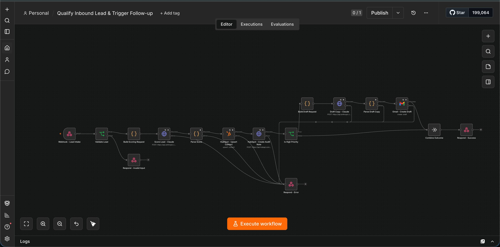
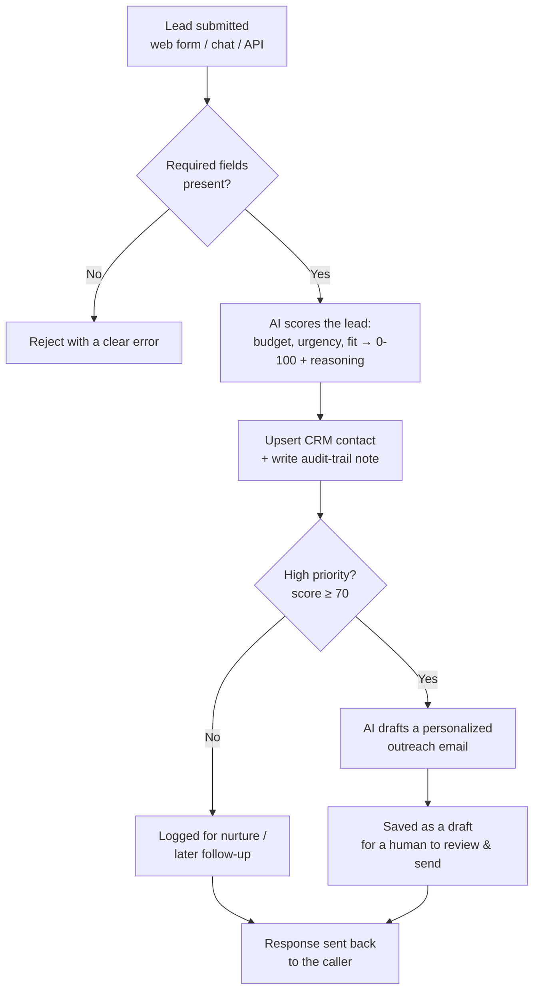

# AI-Powered Lead Qualification & CRM Automation

## The problem

Inbound leads — from a web form, a chat widget, wherever — usually land in an inbox
or a CRM and sit there until someone has time to read them, decide whether they're
worth pursuing, and manually enter notes. That delay costs the best leads (the ones
ready to buy *now* lose momentum while they wait), and it costs the team time (every
lead gets the same manual triage, whether it's a great fit or a waste of an hour).
Qualification criteria also tend to live in one person's head, so two reps judge the
same lead differently, and there's rarely a written record of *why* a lead was
prioritized or dropped.

## What this solves

This workflow qualifies every inbound lead automatically, the moment it arrives:

- **Consistent scoring** — the same criteria applied to every lead, every time, not
  whoever happens to read it first.
- **A reasoned decision, not a black box** — the CRM record shows *why* a lead was
  scored the way it was, so a human can quickly sanity-check or override it.
- **Only real opportunities interrupt a human** — high-priority leads get a
  ready-to-send outreach email drafted immediately; everything else is logged for
  later without demanding anyone's attention.
- **Nothing sends itself** — outreach is always a draft. A person reviews and sends.

The result: hot leads get a response while they're still hot, low-value leads stop
eating manual review time, and every decision is auditable after the fact.

## How it works

The workflow as it actually runs in n8n:



And the same flow simplified:



Every external call retries automatically on a transient failure, and any real
failure returns a clean error instead of leaving the caller hanging.

## The scoring model

Each lead is scored on three dimensions, weighted so that fit matters most — a big
budget for the wrong kind of work is still a poor-fit lead:

- **Budget signal** — explicit number/range, implied by scope, or none.
- **Urgency signal** — immediate, near-term, or purely exploratory.
- **Fit signal** — how well the request matches the services on offer.

The AI returns a score *and* its reasoning as structured data (forced tool-calling,
not free text to parse), and that reasoning is what gets written into the CRM as the
audit note. The score thresholds that decide the outcome (high-priority / nurture /
log-only) are fixed, ordinary logic — not left up to the model — so the same score
always produces the same decision.

**On the AI provider:** this build uses Claude for scoring and drafting, via forced
tool/function-calling so the output is always structured JSON rather than prose to
parse. That's a pattern most major LLM providers support (OpenAI, Gemini, etc.), so
this isn't locked to one vendor — swapping providers means updating the two API
call/response steps to match the new provider's request and response shape, not
redesigning the workflow.

## Setup

1. **Import** `workflow.json` into n8n (Workflows → Import from File).
2. **Create credentials** for each of the following, then attach them to the
   matching nodes (n8n will show which nodes are missing a credential):

   | Credential | Type | Used by |
   |---|---|---|
   | Anthropic API key | Header Auth (`x-api-key`) | Score Lead - Claude, Draft Copy - Claude |
   | HubSpot access token | HubSpot App Token | HubSpot - Upsert Contact |
   | HubSpot access token | Bearer Auth | HubSpot - Create Audit Note |
   | Gmail OAuth2 (`gmail.compose` scope only) | Gmail OAuth2 | Gmail - Create Draft |
   | A random shared secret | Header Auth (`X-Webhook-Secret`) | Webhook - Lead Intake |

3. **Add custom contact properties** in HubSpot (Settings → Properties → Contact
   properties): `lead_qualification_score`, `lead_qualification_reasoning`,
   `lead_budget_signal`, `lead_urgency_signal`, `lead_fit_signal`,
   `lead_recommended_action`.
4. **Activate** the workflow. The webhook path is `/webhook/qualify-lead` (POST),
   and every request must include the `X-Webhook-Secret` header matching the
   credential from step 2.

## Example request

```bash
curl -X POST https://your-n8n-instance/webhook/qualify-lead \
  -H "Content-Type: application/json" \
  -H "X-Webhook-Secret: your-shared-secret" \
  -d '{
    "name": "Jordan Lee",
    "email": "jordan@example.com",
    "company": "Acme Co",
    "message": "We need an n8n workflow to qualify inbound leads and push them to HubSpot, budget around $5k, would like to start this month."
  }'
```

```json
{
  "status": "success",
  "email": "jordan@example.com",
  "score": 92,
  "recommended_action": "high_priority_outreach",
  "contact_id": 123456789
}
```

## Security

- The webhook requires a shared-secret header — no request without the correct
  `X-Webhook-Secret` reaches any downstream node, so an exposed URL alone can't
  trigger API spend or CRM writes.
- No credentials, tokens, or secrets are stored in this repo. `workflow.json` is
  exported with all credential references stripped — every node needs its
  credential reattached after import.
- Gmail access is scoped to `gmail.compose` only (drafts), never `send` — outreach
  emails always go through a human before delivery.

## Stack

n8n · an LLM with tool/function-calling for structured output (built with Claude) ·
HubSpot CRM (contacts + notes v3 API) · Gmail API (drafts only).
